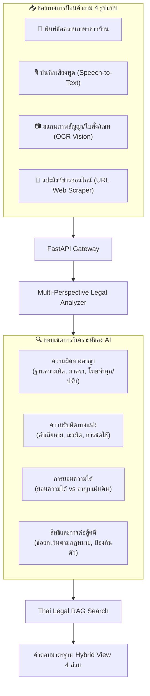

# 🏛️ แผนแม่บทโครงการ PROJECT_L: สารานุกรม AI กฎหมายไทยฉบับสมบูรณ์ & เกราะคุ้มครองสิทธิส่วนบุคคล
> **เอกสารพิมพ์เขียวและข้อกำหนดทางเทคนิคฉบับสมบูรณ์ระดับละเอียดสูงสุด (Ultimate Master Specification & Technical Blueprint)**  
> *สถานะโครงการ: แผนงานฉบับสมบูรณ์ (Production-Ready Architecture)*  
> *เป้าหมาย: ระบบ AI ผู้เชี่ยวชาญกฎหมายไทย "ทุกฉบับ" + คลังตัวบทกฎหมายทั้งประเทศ + ระบบถามตอบวิเคราะห์ข่าวและเหตุการณ์ได้ทุกเรื่อง + เกราะป้องกันสิทธิประชาชนและรับมือเจ้าหน้าที่รัฐแบบ Self-Hosted 100%*

---

## 📑 สารบัญ (Table of Contents)
1. [บทสรุปผู้บริหารและวิสัยทัศน์โครงการ (Executive Summary & Mission)](#1-บทสรุปผู้บริหารและวิสัยทัศน์โครงการ)
2. [สารานุกรมคลังกฎหมายไทยครบทุกหมวดหมู่ (The Complete Thai Law Corpus)](#2-สารานุกรมคลังกฎหมายไทยครบทุกหมวดหมู่)
3. [ระบบ AI Universal Q&A & วิเคราะห์เหตุการณ์/ข่าวทุกรูปแบบ (AI Intelligence Engine)](#3-ระบบ-ai-universal-qa--วิเคราะห์เหตุการณ์ข่าวทุกรูปแบบ)
4. [5 เสาหลักนิติศาสตร์ขั้นสูง (Advanced Legal Pillars & Action Tools)](#4-5-เสาหลักนิติศาสตร์ขั้นสูง)
5. [โมดูลเกราะคุ้มครองสิทธิ & รับมือตำรวจ/ด่านตรวจ (Active Defense & Anti-Extortion)](#5-โมดูลเกราะคุ้มครองสิทธิ--รับมือตำรวจด่านตรวจ)
6. [สถาปัตยกรรมทางเทคนิคเชิงลึก (Deep Technical Architecture & RAG Pipeline)](#6-สถาปัตยกรรมทางเทคนิคเชิงลึก)
7. [การออกแบบฐานข้อมูลและ Data Schema กฎหมายไทย (Data Schema & Ingestion)](#7-การออกแบบฐานข้อมูลและ-data-schema-กฎหมายไทย)
8. [ความปลอดภัย ความเป็นส่วนตัว และสถาปัตยกรรม Self-Hosted (Privacy & Infrastructure)](#8-ความปลอดภัย-ความเป็นส่วนตัว-และสถาปัตยกรรม-self-hosted)
9. [การออกแบบประสบการณ์ผู้ใช้และหน้าจอ Mobile App (Detailed UI/UX Workflow)](#9-การออกแบบประสบการณ์ผู้ใช้และหน้าจอ-mobile-app)
10. [แผนงานพัฒนาแบบละเอียดและชุดทดสอบสถานการณ์จริง (Roadmap & Test Scenarios)](#10-แผนงานพัฒนาแบบละเอียดและชุดทดสอบสถานการณ์จริง)

---

## 1. บทสรุปผู้บริหารและวิสัยทัศน์โครงการ

**PROJECT_L** ถูกสร้างขึ้นเพื่อทำลายกำแพงความซับซ้อนทางกฎหมาย และมอบ **"ความคุ้มครองทางกฎหมายที่แม่นยำ ทันเวลา และเป็นส่วนตัว 100%"** ให้แก่คนธรรมดา โดยรวมองค์ประกอบ 3 ด้านที่ไม่มีระบบใดเคยทำพร้อมกันมาก่อน:

```
                      ┌───────────────────────────────────────────────────────────┐
                      │              🏛️ PROJECT_L UNIVERSAL BRAIN                │
                      └─────────────────────────────┬─────────────────────────────┘
                                                    │
         ┌──────────────────────────────────────────┼──────────────────────────────────────────┐
         │                                          │                                          │
         ▼                                          ▼                                          ▼
┌───────────────────────────┐              ┌───────────────────────────┐              ┌───────────────────────────┐
│ 📚 คลังกฎหมายไทยทุกฉบับ   │              │ 🤖 AI Universal Q&A       │              │ 🛡️ เกราะคุ้มครองสิทธิ      │
│  - ประมวลกฎหมาย 6 ฉบับ    │              │  - วิเคราะห์ข่าว/คดีดัง   │              │  - เช็กด่านลอย / Bodycam  │
│  - พ.ร.บ. เฉพาะทางทุกฉบับ │              │  - รับภาพ/เสียง/ลิงก์ข่าว │              │  - ค่าปรับจริง vs ใต้โต๊ะ │
│  - ฎีกา & กฎกระทรวง       │              │  - สรุปภาษาชาวบ้าน+ตัวบท │              │  - ป้องกันตำรวจใช้อำนาจผิด│
└───────────────────────────┘              └───────────────────────────┘              └───────────────────────────┘
```

---

## 2. สารานุกรมคลังกฎหมายไทยครบทุกหมวดหมู่ (The Complete Thai Law Corpus)

ระบบจะจัดเก็บ ประมวลผล และทำดัชนี (Index) กฎหมายไทยฉบับแท้จาก **สำนักงานคณะกรรมการกฤษฎีกา** และ **ราชกิจจานุเบกษา** ครบถ้วนทุกระดับชั้น:

### 2.1 ประมวลกฎหมายหลักทั้งประเทศ (The Codes of Thailand)
1. **ประมวลกฎหมายอาญา (ป.อ.):**
   - ความผิดเกี่ยวกับความมั่นคงแห่งราชอาณาจักรและเจ้าพนักงาน (ม.136 - ม.166) รวมถึง **มาตรา 157 (เจ้าพนักงานปฏิบัติหน้าที่มิชอบ)** และ **มาตรา 148 (ข่มขืนใจให้มอบทรัพย์)**
   - ความผิดเกี่ยวกับความสงบสุขของประชาชนและการก่อการร้าย (ม.209 - ม.216)
   - ความผิดต่อชีวิตและร่างกาย (ม.288 - ม.300) ฆ่า, ทำร้ายร่างกาย, ประมาทเป็นเหตุให้ผู้อื่นถึงแก่ความตาย
   - ความผิดต่อเสรีภาพและชื่อเสียง (ม.309 - ม.333) ข่มขืนใจ, กักขังหน่วงเหนี่ยว, **หมิ่นประมาท (ม.326, 328)**, ดูหมิ่นซึ่งหน้า
   - ความผิดเกี่ยวกับทรัพย์ (ม.334 - ม.366) ลักทรัพย์, วิ่งราว, กรรโชกทรัพย์ (ม.337), รีดเอาทรัพย์, ฉ้อโกง (ม.341), ยักยอก, รับของโจร, ทำให้เสียทรัพย์ (ม.358), บุกรุก

2. **ประมวลกฎหมายแพ่งและพาณิชย์ (ป.พ.พ.) ครบทั้ง 6 บรรพ:**
   - **บรรพ 1 (หลักทั่วไป):** บุคคล, สภาพบุคคล, นิติกรรม, โมฆะ/โมฆียะ, ระยะเวลา, อายุความทั่วไป
   - **บรรพ 2 (หนี้):** ผลแห่งหนี้, การชำระหนี้, ลูกหนี้ร่วม, การโอนสิทธิเรียกร้อง, การระงับหนี้, **ละเมิด (ม.420 - ม.452)**
   - **บรรพ 3 (เอกเทศสัญญา):** ซื้อขาย, ขายฝาก, ให้, เช่าทรัพย์, เช่าซื้อ, จ้างแรงงาน, จ้างทำของ, กู้ยืมเงิน (ม.653), ค้ำประกัน, จำนอง, ตัวแทน
   - **บรรพ 4 (ทรัพย์สิน):** กรรมสิทธิ์, แดนกรรมสิทธิ์, ครอบครองปรปักษ์ (ม.1382), ทางจำเป็น (ม.1349), ภาระจำยอม (ม.1387)
   - **บรรพ 5 (ครอบครัว):** การหมั้น, การสมรส, สัญญาก่อนสมรส, ทรัพย์สินระหว่างสามีภรรยา (สินส่วนตัว/สินสมรส), การหย่า, ค่าอุปการะเลี้ยงดู, อำนาจปกครองบุตร
   - **บรรพ 6 (มรดก):** การตกทอดแห่งมรดก, ลำดับทายาทโดยธรรม 6 ลำดับ (ม.1629), สิทธิคู่สมรส, การทำพินัยกรรม, การตั้งผู้จัดการมรดก

3. **ประมวลกฎหมายวิธีพิจารณาความอาญา (ป.วิ.อ.):**
   - สิทธิของผู้ต้องหาและจำเลย (ม.7/1, ม.8)
   - หลักเกณฑ์การจับกุมและความผิดซึ่งหน้า (ม.78, ม.80)
   - สิทธิในการไม่ให้การในชั้นจับกุมและการพบทนายความ (ม.84, ม.134)
   - หลักเกณฑ์การตรวจค้นในที่สาธารณะ (ม.93) และการค้นเคหสถาน (ม.92)
   - อำนาจการควบคุมตัวและการปล่อยชั่วคราว (การประกันตัว)

4. **ประมวลกฎหมายวิธีพิจารณาความแพ่ง (ป.วิ.พ.):**
   - เขตอำนาจศาล, การยื่นคำฟ้อง, การส่งหมาย, กระบวนพิจารณา, การบังคับคดีและยึดทรัพย์

5. **ประมวลกฎหมายที่ดิน:**
   - หนังสือแสดงสิทธิในที่ดิน (โฉนดที่ดิน, น.ส.3, ส.ป.ก., ภ.บ.ท.5), การรังวัดที่ดิน, การโอนกรรมสิทธิ์

6. **ประมวลรัษฎากร:**
   - ภาษีเงินได้บุคคลธรรมดา, ภาษีเงินได้นิติบุคคล, ภาษีมูลค่าเพิ่ม (VAT), ภาษีธุรกิจเฉพาะ, ภาษีหัก ณ ที่จ่าย

---

### 2.2 กฎหมายจราจรและการขนส่งทางบก
- **พ.ร.บ. จราจรทางบก พ.ศ. 2522 (และฉบับแก้ไขเพิ่มเติม 2562, 2565):**
  - มาตรา 31/1: **ยกเลิกอำนาจการยึดใบขับขี่ตัวจริงของตำรวจ** และรองรับใบขับขี่ดิจิทัล
  - การตรวจวัดระดับแอลกอฮอล์ (เกณฑ์ไม่เกิน 50 mg% และ 20 mg% สำหรับผู้ขับขี่อายุไม่ถึง 20 ปี)
  - สิทธิและผลของการปฏิเสธการเป่าแอลกอฮอล์
  - ระบบตัดคะแนนความประพฤติในการขับรถ (ระบบ 12 คะแนน)
  - อัตราค่าปรับมาตรฐานตามประกาศสำนักงานตำรวจแห่งชาติ
- **พ.ร.บ. รถยนต์ พ.ศ. 2522 & พ.ร.บ. การขนส่งทางบก:** ภาษีประจำปี, พ.ร.บ.คุ้มครองผู้ประสบภัยจากรถ (พ.ร.บ.ภาคบังคับ), การดัดแปลงสภาพรถ

---

### 2.3 กฎหมายดิจิทัล เทคโนโลยี และไซเบอร์
- **พ.ร.บ. ว่าด้วยการกระทำความผิดเกี่ยวกับคอมพิวเตอร์ (ฉบับที่ 1 พ.ศ. 2550 และฉบับที่ 2 พ.ศ. 2560):**
  - ม.14(1): การนำเข้าข้อมูลเท็จสู่ระบบคอมพิวเตอร์อันก่อให้เกิดความเสียหาย
  - ม.14(4): การนำเข้าข้อมูลลามกอนาจาร
  - ม.16: การตัดต่อภาพผู้อื่นให้อับอายหรือเสียชื่อเสียง
- **พ.ร.บ. คุ้มครองข้อมูลส่วนบุคคล พ.ศ. 2562 (PDPA):** การเก็บ รวบรวม ใช้ หรือเปิดเผยข้อมูลส่วนบุคคลโดยไม่ได้รับความยินยอม
- **พ.ร.ก. มาตรการป้องกันและปราบปรามอาชญากรรมทางเทคโนโลยี พ.ศ. 2566:**
  - โทษของการเปิดหรือยินยอมให้ใช้ **บัญชีม้า / ซิมม้า** (จำคุกสูงสุด 3 ปี หรือปรับ 300,000 บาท)
  - อำนาจธนาคารในการอายัดบัญชีชั่วคราวเมื่อได้รับแจ้งเหตุโกงออนไลน์ทันที 72 ชั่วโมง

---

### 2.4 กฎหมายคุ้มครองผู้บริโภค การค้า และการเงิน
- **พ.ร.บ. คุ้มครองผู้บริโภค พ.ศ. 2522 (และแก้ไขเพิ่มเติม):** การโฆษณาเกินจริง, สินค้าชำรุดบกพร่อง, สิทธิการคืนสินค้า
- **พ.ร.บ. ว่าด้วยข้อสัญญาที่ไม่เป็นธรรม พ.ศ. 2540:** การตัดสัญญาเช่า/สัญญากู้ยืมที่กำหนดเบี้ยปรับเกินสมควร หรือจำกัดความรับผิดฝ่ายเดียว
- **พ.ร.บ. การทวงถามหนี้ พ.ศ. 2558:**
  - ห้ามทวงหนี้ข่มขู่ ดูหมิ่น หรือประจานให้บุคคลภายนอกทราบ
  - กำหนดเวลาทวงหนี้: จันทร์-ศุกร์ (08.00 - 20.00 น.), วันหยุดราชการ (08.00 - 18.00 น.), ทวงได้ไม่เกินวันละ 1 ครั้ง
- **พ.ร.บ. ห้ามเรียกดอกเบี้ยเกินอัตรา พ.ศ. 2560:** ห้ามคิดดอกเบี้ยเงินกู้เกินร้อยละ 15 ต่อปี (โทษจำคุกสูงสุด 2 ปี)
- **พ.ร.บ. วิธีพิจารณาคดีผู้บริโภค พ.ศ. 2551:** ประชาชนสามารถยื่นฟ้องคดีผู้บริโภคได้ฟรีโดยไม่ต้องวางเงินค่าธรรมเนียมศาล

---

### 2.5 กฎหมายแรงงานและการจ้างงาน
- **พ.ร.บ. คุ้มครองแรงงาน พ.ศ. 2541:**
  - อัตราค่าชดเชยการเลิกจ้างตามอายุงาน (ม.118):
    - ทำงานครบ 120 วัน แต่ไม่ครบ 1 ปี ➡️ ได้ 30 วัน
    - ครบ 1 ปี แต่ไม่ครบ 3 ปี ➡️ ได้ 90 วัน
    - ครบ 3 ปี แต่ไม่ครบ 6 ปี ➡️ ได้ 180 วัน
    - ครบ 6 ปี แต่ไม่ครบ 10 ปี ➡️ ได้ 240 วัน
    - ครบ 10 ปี แต่ไม่ครบ 20 ปี ➡️ ได้ 300 วัน
    - ครบ 20 ปีขึ้นไป ➡️ ได้ 400 วัน
  - ค่าตกใจแทนการบอกกล่าวล่วงหน้า (ม.17)
  - วันลาป่วย (ลาได้เท่าที่ป่วยจริง จ่ายค่าจ้างไม่เกิน 30 วันทำงาน), วันลาพักร้อน, การทำงานล่วงเวลา (OT)
- **พ.ร.บ. ประกันสังคม พ.ศ. 2533:** สิทธิประโยชน์กรณีว่างงาน, เจ็บป่วย, ทุพพลภาพ, คลอดบุตร, ชราภาพ

---

### 2.6 กฎหมายควบคุมเจ้าหน้าที่รัฐ & พ.ร.บ. อุ้มหายฯ 2565
- **พ.ร.บ. ป้องกันและปราบปรามการทรมานและการกระทำให้บุคคลสูญหาย พ.ศ. 2565:**
  - **มาตรา 22:** ในการควบคุมตัว เจ้าหน้าที่ต้อง **บันทึกภาพและเสียงอย่างต่อเนื่อง** ตั้งแต่เริ่มจับกุมจนกระทั่งส่งมอบตัว
  - **มาตรา 23:** บันทึกข้อมูลรายละเอียดเกี่ยวกับผู้ถูกควบคุมตัว (วันเวลา สถานที่ สภาพร่างกาย เจ้าหน้าที่ผู้จับ)
  - **มาตรา 24:** ญาติ ทนายความ หรือผู้มีส่วนได้เสียมีสิทธิร้องขอตรวจสอบบันทึกภาพและเสียงได้
- **ประมวลกฎหมายอาญา มาตรา 157:** เจ้าพนักงานปฏิบัติหรือละเว้นการปฏิบัติหน้าที่โดยมิชอบ หรือโดยทุจริต
- **ประมวลกฎหมายอาญา มาตรา 148:** เจ้าพนักงานใช้อำนาจในตำแหน่งโดยมิชอบ ข่มขืนใจหรือจูงใจเพื่อให้บุคคลใดมอบทรัพย์สิน
- **ประมวลกฎหมายอาญา มาตรา 337:** ความผิดฐานกรรโชกทรัพย์

---

### 2.7 กฎหมายเฉพาะทางอื่นๆ & รัฐธรรมนูญ
- **พ.ร.บ. อาวุธปืน เครื่องกระสุนปืนฯ พ.ศ. 2490:** การพกพาในที่สาธารณะ, ใบอนุญาต ป.3 / ป.4 / ป.12
- **ประมวลกฎหมายยาเสพติด พ.ศ. 2564:** การครอบครองเพื่อเสพ vs เพื่อจำหน่าย, การบำบัดรักษา
- **พ.ร.บ. ลิขสิทธิ์ และ พ.ร.บ. เครื่องหมายการค้า:** การละเมิดลิขสิทธิ์ภาพถ่าย, เพลง, ซอฟต์แวร์, การนำเข้าสินค้าเลียนแบบ
- **รัฐธรรมนูญแห่งราชอาณาจักรไทย พ.ศ. 2560:** หมวด 3 สิทธิและเสรีภาพของปวงชนชาวไทย (สิทธิในชีวิตร่างกาย ม.28, สิทธิในความเป็นอยู่ส่วนตัวและเกียรติยศ ม.32, เสรีภาพในการสื่อสาร ม.36)

---

## 3. ระบบ AI Universal Q&A & วิเคราะห์เหตุการณ์/ข่าวทุกรูปแบบ

AI Engine ทำงานร่วมกับ Google Gemini 1.5 Pro / Flash และ Thai Legal RAG เพื่อรองรับคำถามทุกรูปแบบ:



### 3.1 รูปแบบผลลัพธ์ของคำตอบ (Hybrid Answer Structure)
ทุกคำตอบที่ออกจากระบบจะถูกจัดรูปแบบอย่างชัดเจน 4 ส่วนเสมอ:
1. **ส่วนที่ 1: สรุปภาษาชาวบ้าน (Executive Summary):** ชี้ชัดทันทีใน 2-3 บรรทัดว่า *"ผิดหรือไม่ / ใครต้องรับผิดชอบ / ปรับหรือติดคุกกี่ปี"*
2. **ส่วนที่ 2: การ์ดตัวบทกฎหมายและมาตราทางการ (Statutory Basis):** แสดงชื่อ พ.ร.บ., เลขมาตรา, วรรค และบทลงโทษอย่างเป็นทางการเพื่อใช้อ้างอิง
3. **ส่วนที่ 3: ขั้นตอนรับมือและสิ่งที่ต้องทำต่อไป (Next Action Steps):** Checklist เอกสารที่ต้องเตรียม และสถานที่ที่ต้องไปติดต่อ
4. **ส่วนที่ 4: ข้อสงวนสิทธิ์ทางกฎหมาย (Legal Disclaimer):** คำเตือนทางวิชาการตามมาตรฐานสากล

---

## 4. 5 เสาหลักนิติศาสตร์ขั้นสูง (Advanced Legal Pillars)

```
                                 ┌───────────────────────────────────────────────────────────┐
                                 │                ⚖️ 5 เสาหลักนิติศาสตร์ขั้นสูง               │
                                 └─────────────────────────────┬─────────────────────────────┘
                                                               │
         ┌───────────────────────┬─────────────────────────────┼─────────────────────────────┬───────────────────────┐
         │                       │                             │                             │                       │
         ▼                       ▼                             ▼                             ▼                       ▼
┌──────────────────┐   ┌──────────────────┐          ┌───────────────────┐         ┌───────────────────┐   ┌───────────────────┐
│ 1. ฎีกาอ้างอิง    │   │ 2. คำนวณอายุความ │          │ 3. แผนผังดำเนินคดี│         │ 4. ร่างเอกสาร     │   │ 5. อัปเดตกฎหมาย   │
│ (Court Precedents)│   │ (Limitations)    │          │ (Where to File)   │         │ (Drafting Engine) │   │ (Auto Law Sync)   │
└──────────────────┘   └──────────────────┘          └───────────────────┘         └───────────────────┘   └───────────────────┘
```

1. **คลังคำพิพากษาศาลฎีกา (Supreme Court Precedents):**
   - รวบรวมแนวคำพิพากษาศาลฎีกาที่สำคัญเพื่อวินิจฉัยประเด็นตีความ เช่น การด่าในแชทส่วนตัว, การบันทึกเสียงคู่สนทนาโดยไม่บอกกล่าว, การป้องกันตัวเกินสมควรแก่เหตุ
2. **ระบบคำนวณและแจ้งเตือนอายุความ (Statute of Limitations Tracker):**
   - คำนวณวันหมดอายุความของคดี เช่น คดีเช็ค/หมิ่นประมาท (3 เดือน), คดีละเมิด (1 ปี), คดีบัตรเครดิต (2 ปี), คดีกู้ยืม (10 ปี)
3. **แผนผังสถานที่ดำเนินคดี (Jurisdiction & Filing Navigator):**
   - ชี้เป้าหน่วยงานที่ต้องไปติดต่อ: สน. ท้องที่, `thaipoliceonline.go.th`, ศาลคดีผู้บริโภค e-Filing, สำนักงานคุ้มครองแรงงาน, ศูนย์ดำรงธรรม, ป.ป.ท.
4. **เครื่องมือช่วยร่างเอกสารกฎหมายเบื้องต้น (Legal Drafting Engine):**
   - ร่างหนังสือบอกกล่าวทวงถาม (Notice)
   - ร่างบันทึกคำร้องทุกข์/แจ้งความเพื่อยื่นต่อร้อยเวร
5. **ระบบอัปเดตกฎหมายอัตโนมัติ (Continuous Legal Sync):**
   - ติดตามประกาศราชกิจจานุเบกษาเพื่ออัปเดตตัวบทกฎหมายที่แก้ไขใหม่เข้าสู่ฐานข้อมูลโดยอัตโนมัติ

---

## 5. โมดูลเกราะคุ้มครองสิทธิ & รับมือตำรวจ/ด่านตรวจ (Active Defense & Anti-Extortion)

### 5.1 ระบบตรวจสอบด่านตรวจถูกระเบียบหรือไม่ (Checkpoint Compliance Checklist)
- **Checklist 4 องค์ประกอบสำคัญ:**
  1. [ ] **ป้ายหยุดตรวจ & ป้ายชื่อผู้ควบคุมด่าน:** ต้องมีป้ายหยุดตรวจชัดเจน และมีชื่อ-ยศ ของนายตำรวจชั้นสัญญาบัตร (ร.ต.ต. ขึ้นไป)
  2. [ ] **กล้อง Bodycam ประจำตัวตำรวจ:** บันทึกภาพและเสียงต่อเนื่องตาม **พ.ร.บ. อุ้มหายฯ 2565 มาตรา 22**
  3. [ ] **แสงสว่างและจุดตั้งด่าน:** ต้องอยู่ในทำเลเปิดเผย ไม่อยู่ทางโค้งหรือมุมอับ
  4. [ ] **การตรวจค้นตาม ป.วิ.อ. มาตรา 93:** ต้องมี "เหตุอันควรสงสัย" ไม่ใช่การสุ่มตรวจตามอำเภอใจ
- **สิทธิที่ประชาชนต้องรู้:** ตำรวจ **ไม่มีอำนาจ** บังคับยึดโทรศัพท์มือถือเพื่อดูแชท และ **ไม่มีอำนาจยึดใบขับขี่ตัวจริง** ตาม พ.ร.บ. จราจรทางบก ฉบับที่ 12

### 5.2 ระบบประเมินค่าปรับตามเกณฑ์จริง vs เงินใต้โต๊ะ (Fine Matrix)
- ฐานข้อมูลอัตราค่าปรับมาตรฐานตามประกาศสำนักงานตำรวจแห่งชาติ
- ลิงก์ตรงเข้าระบบ **e-Ticket ใบสั่งออนไลน์ (`ptm.police.go.th`)** และแอป **เป๋าตัง / Mobile Banking** ชำระตรงเข้ารัฐ ไม่จ่ายเงินสดกับเจ้าหน้าที่รายบุคคล

---

## 6. สถาปัตยกรรมทางเทคนิคเชิงลึก (Deep Technical Architecture & RAG Pipeline)

```
[ 📱 Flutter Client บนมือถือ ]
        │
        ├── (Offline Mode) ──> [ Local Database: SQLite / Hive ]
        │                       - ตารางค่าปรับจราจรมาตรฐาน
        │                       - Checklist ตรวจสอบด่านลอย
        │                       - ตัวบทกฎหมายหลัก (ป.วิ.อ. 93, พรบ.อุ้มหาย ม.22)
        │
        └── (Online Mode)  ──> [ 🖥️ Self-Hosted FastAPI Backend ]
                                      │
                                      ├── [ Query Router & Keyword Extractor ]
                                      │
                                      ├── [ Hybrid Search Engine ]
                                      │     ├── BM25 Full-Text Search (ค้นเลขมาตราเป๊ะๆ)
                                      │     └── Vector Search (ChromaDB / Qdrant)
                                      │
                                      ├── [ Cross-Encoder Reranker (คัดกรองมาตราตรงจุด) ]
                                      │
                                      ├── [ Grounding Guard & Gemini 1.5 Pro/Flash ]
                                      │
                                      └── [ Rule-Based Citation Verification Engine ]
```

---

## 7. การออกแบบฐานข้อมูลและ Data Schema กฎหมายไทย (Data Schema)

ข้อมูลกฎหมายไทยจะถูกเก็บในรูปแบบ Structured JSON เพื่อความแม่นยำสูงสุด:

```json
{
  "statute_id": "CRIMINAL_CODE_TH",
  "statute_name_th": "ประมวลกฎหมายอาญา",
  "category": "criminal",
  "last_amended_year_be": 2562,
  "sections": [
    {
      "section_number": "157",
      "title": "เจ้าพนักงานปฏิบัติหรือละเว้นการปฏิบัติหน้าที่โดยมิชอบ",
      "content": "ผู้ใดเป็นเจ้าพนักงาน ปฏิบัติหรือละเว้นการปฏิบัติหน้าที่โดยมิชอบ เพื่อให้เกิดความเสียหายแก่ผู้หนึ่งผู้ใด หรือปฏิบัติหรือละเว้นการปฏิบัติหน้าที่โดยทุจริต ต้องระวางโทษจำคุกตั้งแต่หนึ่งปีถึงสิบปี หรือปรับตั้งแต่สองหมื่นบาทถึงสองแสนบาท หรือทั้งจำทั้งปรับ",
      "paragraphs": [
        {
          "index": 1,
          "content": "ผู้ใดเป็นเจ้าพนักงาน..."
        }
      ],
      "penalties": {
        "min_imprisonment_years": 1,
        "max_imprisonment_years": 10,
        "min_fine_thb": 20000,
        "max_fine_thb": 200000,
        "is_compoundable": false
      },
      "tags": ["เจ้าพนักงาน", "ปฏิบัติหน้าที่มิชอบ", "ละเว้นการปฏิบัติหน้าที่", "ยอมความไม่ได้"],
      "related_sections": ["148", "149", "150"]
    }
  ]
}
```

---

## 8. ความปลอดภัย ความเป็นส่วนตัว และสถาปัตยกรรม Self-Hosted

1. **ความเป็นส่วนตัว 100% (Zero-Knowledge):**
   - ใช้งานแบบ Anonymous ไม่มีการเก็บเบอร์โทรศัพท์ อีเมล หรือบัญชีผู้ใช้
   - ประวัติการค้นหาและข้อความแชทถูกบันทึกบนเครื่องมือถือของผู้ใช้เท่านั้น พร้อมปุ่มล้างข้อมูลทั้งหมดใน 1 คลิก
2. **การติดตั้งบนเครื่องส่วนตัว (Self-Hosted):**
   - รัน Backend (FastAPI + ChromaDB) บนเครื่อง Mac / PC / Home Server
   - เชื่อมต่อจากนอกบ้านผ่าน **Tailscale VPN** หรือ **Cloudflare Tunnel** ปลอดภัยโดยไม่ต้องเปิด Public Port
3. **การประหยัดค่าใช้จ่าย:**
   - ใช้ Gemini API Key ส่วนตัว (ต้นทุนต่ำมากเพียงไม่กี่บาทต่อเดือนสำหรับการใช้งานส่วนบุคคล)

---

## 9. การออกแบบประสบการณ์ผู้ใช้และหน้าจอ Mobile App (Detailed UI/UX)

```
┌────────────────────────────────────────────────────────┐
│ 🏛️ PROJECT_L                   [ 🟢 Online / 🔵 Local ]│
├────────────────────────────────────────────────────────┤
│ 🔍 ถามกฎหมายไทยได้ทุกเรื่อง (Universal Legal Search)   │
│ [ 💬 พิมพ์คำถาม / แปะลิงก์ข่าว / 🎙️ พูด / 📷 ถ่ายรูป ] │
│                                                        │
│ ⚡ หมวดหมู่กฎหมายยอดนิยม:                                │
│ [ 🚗 จราจร/ด่าน ] [ 🏠 ที่ดิน/บ้าน ] [ 💰 โดนโกง/หนี้ ] │
│ [ 💼 แรงงาน/งาน ] [ 📱 พรบ.คอมฯ/PDPA ] [ ⚖️ มรดก/แพ่ง ]│
├────────────────────────────────────────────────────────┤
│ 🚨 ด่วน: เกราะป้องกันเฉพาะหน้า (Active Defense)        │
│ ┌───────────────────────────┐ ┌──────────────────────┐ │
│ │ 🛑 เช็กด่านตรวจถูกระเบียบ │ │ 💵 เช็กค่าปรับจริง vs│ │
│ │   (Checklist ตรวจด่านลอย) │ │     เงินใต้โต๊ะ      │ │
│ └───────────────────────────┘ └──────────────────────┘ │
├────────────────────────────────────────────────────────┤
│ 🛠️ เครื่องมือช่วยดำเนินคดี (Legal Action Tools)        │
│ • ⏳ คำนวณอายุความคดี (Statute of Limitations)       │
│ • 📝 ร่างหนังสือบอกกล่าวทวงถาม (Notice Generator)      │
│ • 📍 แผนผังช่องทางแจ้งความ / ยื่นฟ้องศาลออนไลน์ฟรี    │
├────────────────────────────────────────────────────────┤
│ 📖 คลังตัวบทกฎหมายไทยทุกฉบับ (Law Reader)              │
│ 📌 ประมวลกฎหมายอาญา / แพ่งและพาณิชย์ / ที่ดิน / แรงงาน  │
└────────────────────────────────────────────────────────┘
```

---

## 10. แผนงานพัฒนาแบบละเอียดและชุดทดสอบสถานการณ์จริง

### 10.1 ลำดับขั้นการพัฒนา (5 Phased Execution Roadmap)
- **ระยะที่ 1: จัดเตรียมข้อมูลกฎหมายไทยทั้งหมด (Data Ingestion):**
  - นำเข้าประมวลกฎหมาย 6 ฉบับ, พ.ร.บ. สำคัญ 50+ ฉบับ, และตารางค่าปรับจราจรลงใน Structured JSON & ChromaDB
- **ระยะที่ 2: พัฒนา AI RAG Engine (FastAPI Backend):**
  - สร้างระบบค้นหา Hybrid Search (BM25 + Dense Vectors) + Prompt Grounding + Rule-based Verification
- **ระยะที่ 3: พัฒนา Mobile App Core Features (Flutter):**
  - พัฒนาหน้า Universal Search, ระบบแชท AI, หน้า Checklist เช็กด่านตรวจ และตารางค่าปรับ (Offline Ready)
- **ระยะที่ 4: พัฒนาเครื่องมือเสริม (Action Tools & Multimodal):**
  - พัฒนาระบบ Voice Input, สแกนเอกสาร OCR, ระบบคำนวณอายุความ, และระบบร่างหนังสือทวงถาม
- **ระยะที่ 5: ติดตั้ง Self-Hosted และทดสอบใช้งานจริง:**
  - ติดตั้ง Private Network (Tailscale) และทดสอบสถานการณ์จำลองครบทุกหมวดหมู่

### 10.2 ชุดทดสอบสถานการณ์จริง (Verification Test Scenarios)
1. **ทดสอบเจอด่านตรวจ:** เช็กการตรวจจับด่านลอย, การตรวจค้นตาม ป.วิ.อ. ม.93, และการบังคับติดกล้อง Bodycam พ.ร.บ.อุ้มหายฯ ม.22
2. **ทดสอบวิเคราะห์ข่าวดัง:** แปะลิงก์ข่าวอาชญากรรม ตรวจสอบว่า AI แจกแจงฐานความผิดและอัตราโทษได้ถูกต้องทุกมาตรา
3. **ทดสอบข้อพิพาทที่ดิน/สัญญา:** ถามกรณีข้างบ้านต่อเติมล้ำเขต หรือถูกเบี้ยวเงินกู้ ตรวจสอบการอ้างอิง ป.พ.พ. และอายุความ
4. **ทดสอบความถูกต้องของตัวบท:** ยืนยันว่า AI ไม่มีการกุเลขมาตราขึ้นมาเอง (Zero Hallucination)
